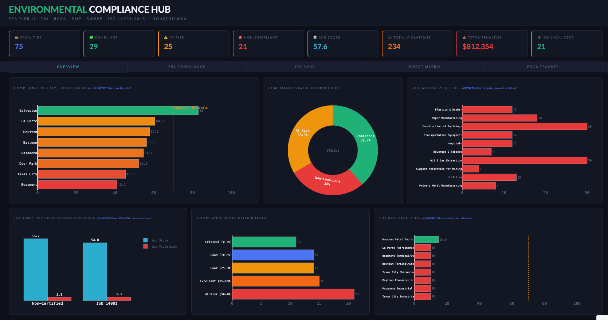
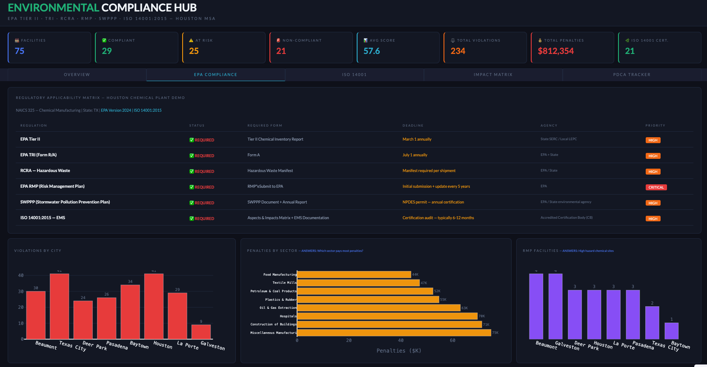
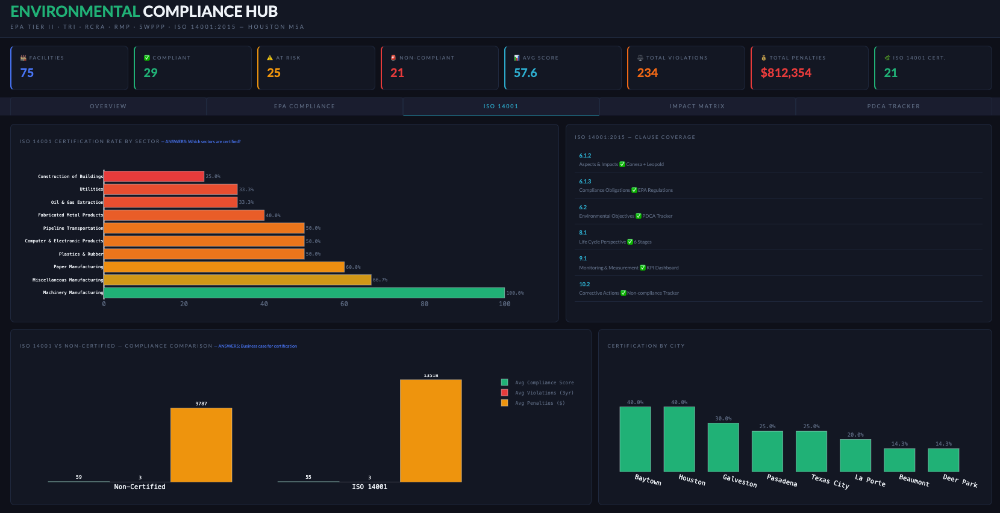
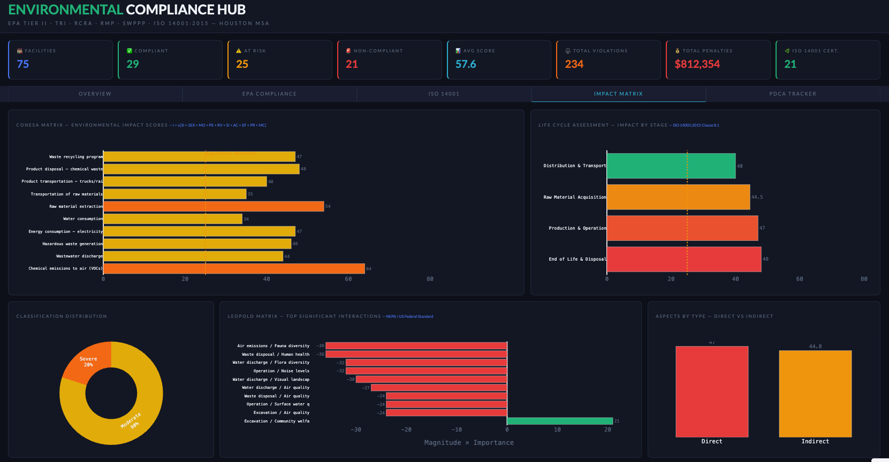
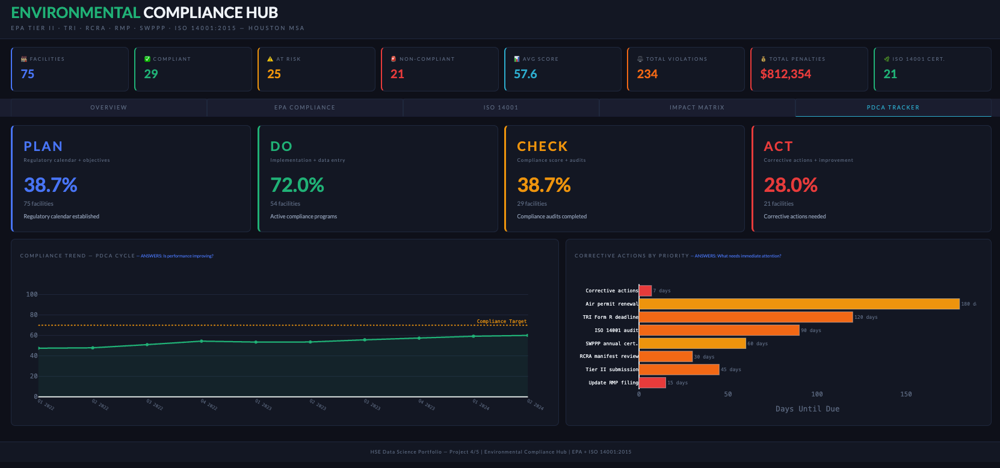
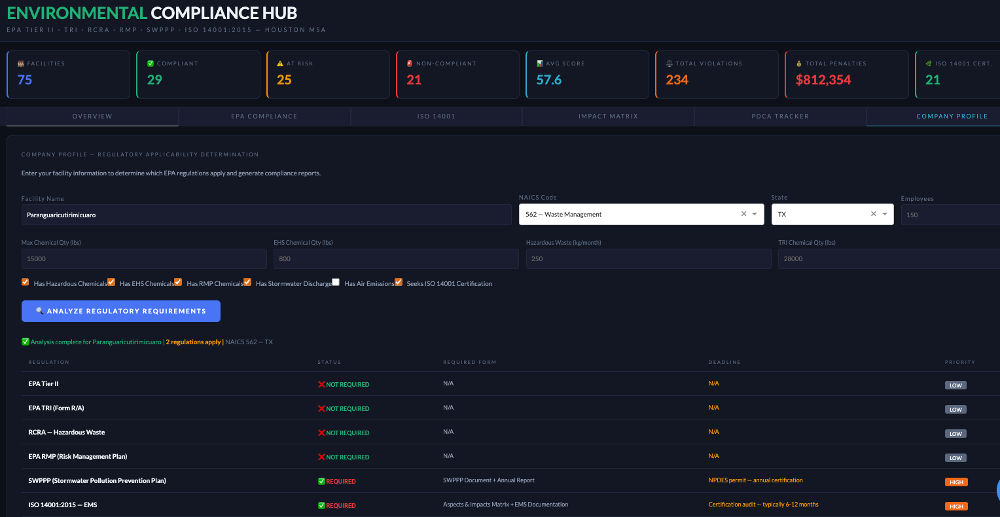

# 🌿 Environmental Compliance Hub

**OSHA Compliance & Risk Analytics | Data Science Portfolio**

[](https://python.org)
[](https://dash.plotly.com)
[](https://iso.org)
[](#license)

## Overview

Comprehensive environmental compliance dashboard covering EPA regulations
and ISO 14001:2015 requirements for industrial facilities across the
Houston Metropolitan Area.

Applicable to any industry subject to environmental regulations —
energy, manufacturing, construction, pharmaceuticals, healthcare,
aerospace, and data centers — in the USA and globally (180+ countries).

## Dashboard Screenshots

### Overview


### EPA Compliance — Regulatory Applicability Matrix


### ISO 14001:2015


### Impact Matrix — Conesa + Leopold


### PDCA Tracker


### Company Profile — Regulatory Determination + Report Downloads


## Regulations Covered

### USA — EPA
| Regulation | Description | Deadline |
|------------|-------------|----------|
| Tier II | Chemical Inventory Report (EPCRA §312) | March 1 |
| TRI Form R/A | Toxic Release Inventory (EPCRA §313) | July 1 |
| RCRA | Hazardous Waste — LQG/SQG/VSQG | Per shipment |
| RMP | Risk Management Plan (CAA §112r) | Every 5 years |
| SWPPP | Stormwater Pollution Prevention Plan | Annual |

### Global — ISO 14001:2015
| Clause | Requirement | Coverage |
|--------|-------------|----------|
| 6.1.2 | Aspects & Impacts | Conesa + Leopold Matrix |
| 6.1.3 | Compliance Obligations | EPA Regulations |
| 6.2 | Environmental Objectives | PDCA Tracker |
| 8.1 | Life Cycle Perspective | 6 Stages |
| 9.1 | Monitoring & Measurement | KPI Dashboard |
| 10.2 | Corrective Actions | Non-compliance Tracker |

## Key Features

- **Regulatory Applicability Engine** — Automatically determines which
  regulations apply based on company profile (NAICS, state, chemical quantities)
- **Conesa Matrix** — Full 10-criteria environmental impact assessment
  `I = ± [3i + 2EX + MO + PE + RV + SI + AC + EF + PR + MC]`
- **Leopold Matrix** — US federal standard for EIA (NEPA)
- **Life Cycle Assessment** — 6 stages per ISO 14001:2015 Clause 8.1
- **PDCA Tracker** — Plan-Do-Check-Act compliance cycle
- **ISO 14001 vs Non-Certified** — Business case for certification

## Dashboard Tabs

| Tab | Content |
|-----|---------|
| Overview | Compliance by city, status distribution, violations by sector |
| EPA Compliance | Regulatory applicability matrix, violations, penalties, RMP |
| ISO 14001 | Certification rates, clause coverage, business case |
| Impact Matrix | Conesa scores, Leopold matrix, life cycle assessment |
| PDCA Tracker | Compliance trend, corrective actions calendar |

## Project Structure
```
environmental_compliance_hub/
├── src/
│   ├── schema.py          # Single source of truth — all regulatory thresholds
│   ├── applicability.py   # Regulatory Applicability Engine
│   ├── impact_matrix.py   # Conesa + Leopold + Life Cycle Assessment
│   ├── epa_data.py        # EPA ECHO data pipeline + synthetic fallback
│   └── analysis.py        # KPI functions and compliance analysis
├── dashboard/
│   └── app.py             # Plotly Dash interactive dashboard
├── data/                  # git ignored
└── requirements.txt
```

## How to Run
```bash
# 1. Clone
git clone https://github.com/WilliamBaronData/environmental-compliance-hub.git
cd environmental-compliance-hub

# 2. Virtual environment
python3 -m venv venv
source venv/bin/activate

# 3. Install dependencies
pip install -r requirements.txt

# 4. Run pipeline
python src/epa_data.py
python src/impact_matrix.py
python src/applicability.py

# 5. Launch dashboard
python dashboard/app.py
# Open: http://127.0.0.1:8053
```

## Regulatory Versioning

All thresholds and regulatory requirements are centralized in `schema.py`.
When ISO 14001:2026 is published or EPA updates thresholds, only one file
needs to change — the rest of the system updates automatically.
```python
REGULATORY_VERSIONS = {
    "iso_14001": "2015",  # Update to "2026" when published
    "tier_ii":   "2024",
    "tri":       "2024",
}
```

## Tech Stack

| Tool | Purpose |
|------|---------|
| Python 3.10+ | Core language |
| Pandas | Data pipeline |
| Plotly Dash | Interactive dashboard |
| NumPy | Calculations |
| Folium | Geographic visualization |
| ReportLab | PDF report generation |

## Global Applicability

| Region | Framework |
|--------|-----------|
| 🇺🇸 USA | EPA — Tier II, TRI, RCRA, RMP, SWPPP + Leopold |
| 🇲🇽 Mexico | SEMARNAT + ISO 14001 + Conesa |
| 🇨🇴 Colombia | ANLA + ISO 14001 + Conesa |
| 🇧🇷 Brazil | IBAMA + ISO 14001 |
| 🇪🇺 Europe | EMAS + ISO 14001 |
| 🌍 180+ countries | ISO 14001 universal |

## License

© 2025 William Baron. All rights reserved.

This project is shared for portfolio and educational purposes only.
Commercial use, redistribution, or claiming authorship is prohibited
without explicit written permission from the author.

---
*Project 4 of 5 — HSE Data Science Portfolio*
*Previous: Real-time Occupational Health Monitoring System*
*Next: Electrical Safety — NFPA 70E + OSHA + ISO 45001*
